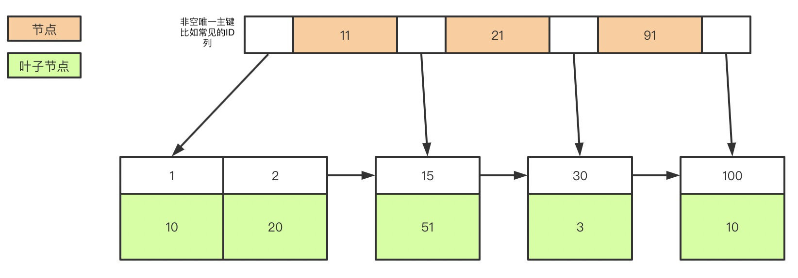
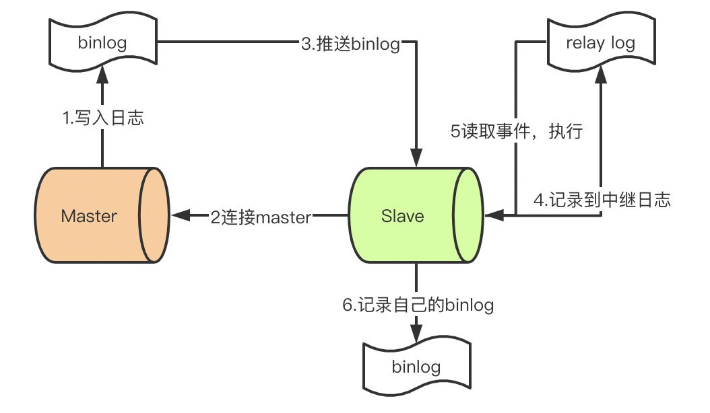

- [引擎](#引擎)
  - [***myisam*** 和 ***innodb*** 的区别](#myisam-和-innodb-的区别)
  - [mysql的索引有哪些，聚簇和非聚簇索引又是什么](#mysql的索引有哪些聚簇和非聚簇索引又是什么)
  - [覆盖索引和回表](#覆盖索引和回表)
- [锁](#锁)
  - [常见的锁](#常见的锁)
- [事务](#事务)
  - [事务基本特性](#事务基本特性)
    - [ACID](#acid)
    - [隔离级别](#隔离级别)
    - [怎么保证ACID](#怎么保证acid)
    - [什么是幻读 什么是mvcc](#什么是幻读-什么是mvcc)
    - [分库分表](#分库分表)
    - [分表后的id唯一性](#分表后的id唯一性)
    - [主从同步](#主从同步)
  

## 引擎
### ***myisam*** 和 ***innodb*** 的区别
myisam引擎是5.1版本之前的默认引擎，支持全文检索、压缩、空间函数等，但是**不支持**事务和行级锁，所以一般用于大量查询少量插入的场景来使用，而且myisam不支持外键，并且索引和数据是分开存储的。innodb是基于聚簇索引建立的，和myisam相反它支持事务、外键，并且通过MVCC来支持高并发，索引和数据存储在一起。

### mysql的索引有哪些，聚簇和非聚簇索引又是什么
索引按照数据结构来说主要包含B+树和Hash索引
B+树是左小右大的顺序存储结构，节点只包含id索引列，而叶子节点包含索引列和数据，这种数据和索引在一起存储的索引方式叫做聚簇索引，一张表只能有一个聚簇索引。假设没有定义主键，InnoDB会选择一个唯一的非空索引代替，如果没有的话则会隐式定义一个主键作为聚簇索引
如图所示，聚簇索引的索引为单独的列，数据放在子节点中 且其他索引也位于叶子节点之上。

myisam使用的非聚簇索引

对于innodb而言 主键索引使用的是聚簇索引，二级索引使用的是非聚簇索引

### 覆盖索引和回表
覆盖索引指的是在一次查询中，如果一个索引包含或者说覆盖所有需要查询的字段的值，我们就称之为覆盖索引，而不再需要回表查询。
使用EXPLAIN sql语句可以查看语句的执行情况
e.g. 假设我们有索引为 `KEY `sim` (`sim`) USING BTREE`
`explain select * from iot_sim where sim = '1440499840795'` 
此语句的extra字段为 **Using index condition** 表示where条件中不包含选择的所有列(因为查询了all)，使用了索引查询之后 还需要回表查询其余字段(因为innodb的索引和数据其实是分开的)
`explain select id,sim from iot_sim where sim = '1440499840795'`
此语句的extra字段为 **Using where; Using index** 其中using index表示无需扫描整表 ‘using where’ 表示虽然有可能扫描table但是更倾向于使用index
## 锁
### 常见的锁
主要分为共享锁(s锁 work in share mode)(读锁)和排他锁(写锁 x锁 exclude mode)
**共享锁**主要用于不更改/不更新数据的操作(只读操作) 获取共享锁的事务只能读数据 不能修改数据 且其他事务可以对数据再添加共享锁
**排他锁** 事务获取某数据的排他锁后，其他事务不能获取该数据的任何类型的锁。获取锁的事务可以对数据进行读/写操作

*乐观锁 和 悲观锁*
*乐观锁*
对加锁持有乐观态度，即先进行业务操作，不到最后一步不加锁。通常的实现方式为：
使用单独的版本号字段 更新的时候版本号+1 更新前检查版本号的一致性 如果和更新前相同 则可以认为该条数据没有修改。 或者使用时间戳的方式(如 更新时间)
*悲观锁*
上述的共享锁和排他锁其实是悲观锁的一种实现
具体实现是 sql语句 最后加上lock in share mode 即为共享锁
最后加上 for update 即为排他锁
按颗粒度来区分 又分为 ***行锁和表锁***
表锁通常会在alter表的时候使用 行锁则是修改操作时使用
## 事务
### 事务基本特性
#### ACID
atomic 原子性 要么全部成功 要么全部失败
consistent 一致性 数据库状态总是从一个状态到另外一个状态
isolation 隔离性 一个事务提交前 其他事务是不可见的
duration 持久性 事务一旦提交 修改会永久保存
#### 隔离级别
**read-uncommit**
读未提交 可能会读到其他事务未提交的数据(脏读)
事务A 读取 事务B未提交的更改数据 之后事务B失败回滚 A读到的是脏数据
**read-commit**
读提交 两次读取结果可能会不一样(不可重复读)
事务A执行时间比较长。开始时读取的数据和结束时读取的数据不一致(中间事务B修改了该数据 并且成功提交)
**repeatable read**
可重复读 mysql的默认级别 可能产生幻读
前提条件：InnoDB引擎，可重复读隔离级别，使用当前读(update insert delete)时。
表现：一个事务(同一个read view)在前后两次查询同一范围的时候，后一次查询看到了前一次查询没有看到的行。两点需要说明：
　　1、在可重复读隔离级别下，普通查询(select)是快照读，是不会看到别的事务插入的数据的，幻读只在当前读下才会出现。
　　2、幻读专指 **新插入** 的行，读到原本存在行的更新结果不算。因为当前读的作用就是能读到所有已经提交记录的最新值
幻读的解决-> 间隙锁(锁一段记录)
**serializable**
串行 一般不会使用 因为性能很低 会给每一行读取的数据都加锁 会产生大量超时和锁竞争

#### 怎么保证ACID
原子性 -> undo log日志保证 包含需要回滚的日志信息
一致性 -> 代码层面保证
隔离性 -> mvcc保证
持久性 -> 持久性内存+redo log 修改数据同时在内存和redo log记录 提交的时候通过redo log刷盘 宕机的时候通过redo log 恢复

#### 什么是幻读 什么是mvcc
mvcc 即为多版本并发控制 保存了数据在某个时间节点的快照
innodb中聚簇索引记录有两个必要的隐藏列即
*trx_id*
修改索引时的事务id
*roll_pointer*
修改索引时会把老版本写入undo日志中 roll_pointer即指向undo日志中上个版本的位置
间隙锁 (唯一索引不会有间隙锁)
比如 有age 10 20 30 三条数据
当我们使用排他锁时
`select * from user where age = 20 for update;`
其他事务要插入age(假设为主键) 则只有10能插入成功
即表自动生成左开右闭的间隙锁区间
$$ ({{-\infty}}, 10],(10,20](20,30](30,{{+\infty}}]$$
20被锁定之后 所以 (10,20](20,30] 会被锁定 无法插入

#### 分库分表
垂直分库 (如 用户 订单 商品 支付 ... 微服务拆分)
垂直分表 字段较多 数据较大的表拆分
水平分表 -> sharding_key 时间纬度切表 比如达到多少数据就分表

#### 分表后的id唯一性
因为我们主键默认都是自增的，那么分表之后的主键在不同表就肯定会有冲突了。有几个办法考虑：设定步长，比如1-1024张表我们分别设定1-1024的基础步长，这样主键落到不同的表就不会冲突了。分布式ID，自己实现一套分布式ID生成算法或者使用开源的比如雪花算法这种分表后不使用主键作为查询依据，而是每张表单独新增一个字段作为唯一主键使用，比如订单表订单号是唯一的，不管最终落在哪张表都基于订单号作为查询依据，更新也一样。

#### 主从同步
1. master提交完事务后，写入binlog
2. slave连接到master，获取binlog
3. master创建dump线程，推送binglog到slave
4. slave启动一个IO线程读取同步过来的master的binlog，记录到relay log中继日志中
5. slave再开启一个sql线程读取relay log事件并在slave执行，完成同步
6. slave记录自己的binglog
