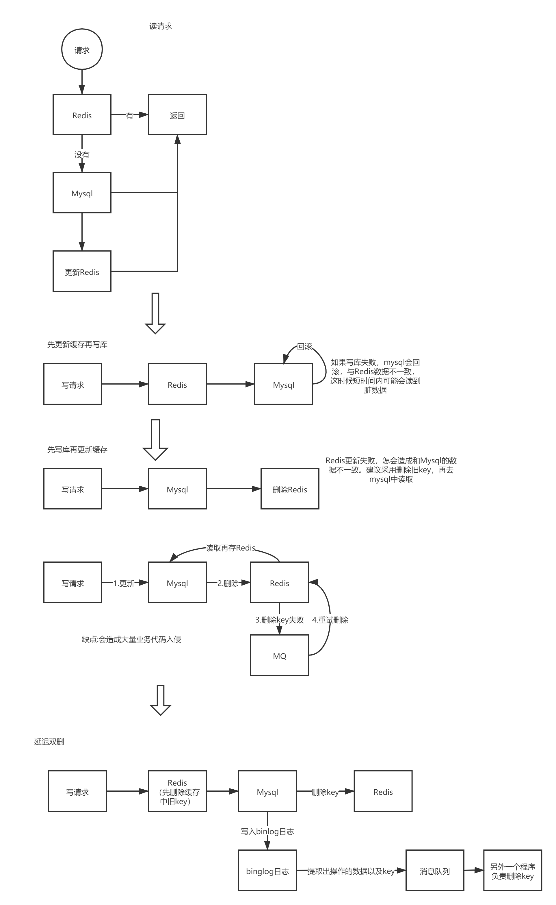

- [几种 I/O 模型](#几种-io-模型)
  - [文件描述符(File Descriptor FD)](#文件描述符file-descriptor-fd)
  - [同步IO和异步IO](#同步io和异步io)
  - [阻塞IO](#阻塞io)
  - [非阻塞IO](#非阻塞io)
    - [select](#select)
    - [poll](#poll)
    - [epoll](#epoll)
- [持久化](#持久化)
  - [AOF](#aof)
    - [同步策略](#同步策略)
    - [重写机制](#重写机制)
  - [RDB](#rdb)
- [RedLock](#redlock)
- [过期键的删除策略](#过期键的删除策略)
- [如何确保缓存一致](#如何确保缓存一致)
  - [先更新数据库，再更新缓存](#先更新数据库再更新缓存)
  - [先删除缓存，再更新数据库](#先删除缓存再更新数据库)
  - [先更新数据库，再删除缓存](#先更新数据库再删除缓存)
- [缓存穿透 缓存击穿 缓存雪崩](#缓存穿透-缓存击穿-缓存雪崩)
  - [缓存穿透](#缓存穿透)
  - [缓存击穿](#缓存击穿)
  - [缓存雪崩](#缓存雪崩)

## 几种 I/O 模型

### 文件描述符(File Descriptor FD)

> 表示指向文件引用的抽象化概念
> 每个Unix进程均有三个标准的文件描述符 即**stdin** **stdout** **stderr**

### 同步IO和异步IO

AIO（异步非阻塞） 客户端在请求数据的过程中，不用保持一个连接，可以做其他事情 客户端向服务端请求数据。服务端若有，则返回数据；若无，则告诉客户端“没有数据”。客户端收到“没有数据”的回复后，就做自己的其他事情。服务端有了数据之后，就主动通知客户端，并把数据返回去

同步的话，可以理解调用某个接口在没有返回结果，就不会往下走

### 阻塞IO

当使用 read 或者 write 对某一个文件描述符进行读写时，如果当前的FD不可读或者不可写 则服务会阻塞至可以读写。这种模型下 每一个连接会创建一个线程处理 直到连接断开。
例子：
应用发送读请求 -> 请求系统内核 -> 等待数据 -> 阻塞直到数据准备好 -> 返回数据 -> 应用处理

### 非阻塞IO

类似阻塞模型 如果数据没有准备好则kernel会返回一个bwouldblock错误 应用会轮询直到数据准备好。


java中的NIO使用的就是多路复用机制。不同操作系统多路复用采用的模型不同 比如windows系统采用select linux采用epoll。select的函数调用可以同时监控多个FD的可读可写情况 当某些FD变为可读可写时 select方法会返回FD的个数。

#### select

select 监视三种fd 分别是read write 和except 调用select会阻塞到有数据 或者超时。返回后可以通过遍历fdset找到就绪的描述符。有最大监视限制(Linux 上为1024个)

#### poll

poll将三个fdset视为一个pollfd 管理监视的event和发生的event 类似select 轮询pollfd来获取就绪的描述符

#### epoll

主要是三个接口

```c
int epoll_create(int size)
int epoll_ctl(int epfd, int op, int fd, struct epoll_event *events)
int epoll_wait(int epfd, epoll_event *events, int maxevents, int timeout)
```

create 方法创建一个size为传入参数的fd限制最大的fd值

ctl方法对指定的fd执行op操作 告诉内核需要监听的事件

```c
struct epoll_event {
    /*
    epoll events
    EPOLLIN 可读
    EPOLLOUT 可写
    EPOLLPRI  优先读
    EPOLLERR 错误
    EPOLLHUP 中断
    EPOLLET 工作模式(Edge Trigger Level Trigger)
    EPOLLONESHOT 只监听一次事件
    */
    __uint32_t events;
    epoll_data_t data;
}
```

wait方法即等待时间的产生 用于返回
工作模式：
ET edge trigger
即高速模式 即read只会读取buffer一次 如果有新数据in不会再次读
LT level trigger
默认的模式 只要fd还有数据可读，每次wait方法都会返回fd的事件

在 select/poll中，进程只有在调用一定的方法后，内核才对所有监视的文件描述符进行扫描，而epoll事先通过epoll_ctl()来注册一 个文件描述符，一旦基于某个文件描述符就绪时，内核会采用类似callback的回调机制，迅速激活这个文件描述符，当进程调用epoll_wait() 时便得到通知。(此处去掉了遍历文件描述符，而是通过监听回调的的机制。这正是epoll的魅力所在。)

## 持久化

优先加载 AOF，当没有 AOF 时才加载 RDB。当 AOF 或者 RDB 存在错误，则加载失败

### AOF

以日志的形式记录每个写操作（读操作不记录），只需追加文件但不可以改写文件，Redis启动时会根据日志从头到尾全部执行一遍以完成数据的恢复工作。包括flushDB也会执行。

主要有两种方式触发：有写操作就写、每秒定时写（也会丢数据）。

因为AOF采用追加的方式，所以文件会越来越大，针对这个问题，新增了重写机制，就是当日志文件大到一定程度的时候，会fork出一条新进程来遍历进程内存中的数据，每条记录对应一条set语句，写到临时文件中，然后再替换到旧的日志文件（类似rdb的操作方式）。默认触发是当aof文件大小是上次重写后大小的一倍且文件大于64M时触发。

当两种方式同时开启时，数据恢复Redis会优先选择AOF恢复。一般情况下，只要使用默认开启的RDB即可，因为相对于AOF，RDB便于进行数据库备份，并且恢复数据集的速度也要快很多。

开启持久化缓存机制，对性能会有一定的影响，特别是当设置的内存满了的时候，更是下降到几百reqs/s。所以如果只是用来做缓存的话，可以关掉持久化。

#### 同步策略

AOF在同步内存数据到磁盘上时，并不是马上把文件写到磁盘，而是先把文件缓存到系统，然后每个30秒将文件写入磁盘，可以在配置文件中配置同步策略

#### 重写机制

AOF的原理是直接把用户插入到redis的命令追加到结尾，那么文件会越来越大，一些重复的命令也越来越多，这时可以利用BGREWRITEAOF命令来重写AOF，重写的配置

### RDB

默认开启，会按照配置的指定时间将内存中的数据快照到磁盘中，创建一个dump.rdb文件，Redis启动时再恢复到内存中。

Redis会单独创建fork()一个子进程(bgsave)，将当前父进程的数据库数据复制到子进程的内存中，然后由子进程写入到临时文件中，持久化的过程结束了，再用这个临时文件替换上次的快照文件，然后子进程退出，内存释放。

需要注意的是，每次快照持久化都会将主进程的数据库数据复制一遍，导致内存开销加倍，若此时内存不足，则会阻塞服务器运行，直到复制结束释放内存；都会将内存数据完整写入磁盘一次，所以如果数据量大的话，而且写操作频繁，必然会引起大量的磁盘I/O操作，严重影响性能，并且最后一次持久化后的数据可能会丢失

## RedLock

假设有5个完全独立的redis主服务器

1.获取当前时间戳

2.client尝试按照顺序使用相同的key,value获取所有redis服务的锁，在获取锁的过程中的获取时间比锁过期时间短很多，这是为了不要过长时间等待已经关闭的redis服务。并且试着获取下一个redis实例。

   比如：TTL为5s,设置获取锁最多用1s，所以如果一秒内无法获取锁，就放弃获取这个锁，从而尝试获取下个锁

3.client通过获取所有能获取的锁后的时间减去第一步的时间，这个时间差要小于TTL时间并且至少有3个redis实例成功获取锁，才算真正的获取锁成功

4.如果成功获取锁，则锁的真正有效时间是 TTL减去第三步的时间差 的时间；比如：TTL 是5s,获取所有锁用了2s,则真正锁有效时间为3s(其实应该再减去时钟漂移);

5.如果客户端由于某些原因获取锁失败，便会开始解锁所有redis实例；因为可能已经获取了小于3个锁，必须释放，否则影响其他client获取锁

## 过期键的删除策略

我们都知道，Redis是key-value数据库，我们可以设置Redis中缓存的key的过期时间。Redis的过期策略就是指当Redis中缓存的key过期了，Redis如何处理。

过期策略通常有以下三种：

**定时过期**：每个设置过期时间的key都需要创建一个定时器，到过期时间就会立即清除。该策略可以立即清除过期的数据，对内存很友好；但是会占用大量的CPU资源去处理过期的数据，从而影响缓存的响应时间和吞吐量。

**惰性过期**：只有当访问一个key时，才会判断该key是否已过期，过期则清除。

该策略可以最大化地节省CPU资源，却对内存非常不友好。极端情况可能出现大量的过期key没有再次被访问，从而不会被清除，占用大量内存。

**定期过期**：每隔一定的时间，会扫描一定数量的数据库的expires字典中一定数量的key，并清除其中已过期的key。该策略是前两者的一个折中方案。通过调整定时扫描的时间间隔和每次扫描的限定耗时，可以在不同情况下使得CPU和内存资源达到最优的平衡效果。

(expires字典会保存所有设置了过期时间的key的过期时间数据，其中，key是指向键空间中的某个键的指针，value是该键的毫秒精度的UNIX时间戳表示的过期时间。键空间是指该Redis集群中保存的所有键。)

Redis中同时使用了惰性过期和定期过期两种过期策略。

## 如何确保缓存一致

主要的三种缓存策略

1. 先更新数据库，再更新缓存
2. 先删除缓存，再更新数据库
3. 先更新数据库，再删除缓存

### 先更新数据库，再更新缓存

（1）如果你是一个写数据库场景比较多，而读数据场景比较少的业务需求，采用这种方案就会导致，数据压根还没读到，缓存就被频繁的更新，浪费性能。
（2）如果你写入数据库的值，并不是直接写入缓存的，而是要经过一系列复杂的计算再写入缓存。那么，每次写入数据库后，都再次计算写入缓存的值，无疑是浪费性能的。显然，删除缓存更为适合

### 先删除缓存，再更新数据库

采用延时双删策略 即先删除缓存 写入数据库 等待一段时间 再删除一次缓存(可能被其他线程更新了)

### 先更新数据库，再删除缓存
 
失效：应用程序先从cache取数据，没有得到，则从数据库中取数据，成功后，放到缓存中。
命中：应用程序从cache中取数据，取到后返回。
更新：先把数据存到数据库中，成功后，再让缓存失效




## 缓存穿透 缓存击穿 缓存雪崩

### 缓存穿透

缓存穿透是指缓存和数据库中都没有的数据，而用户不断发起请求，我们数据库的 id 都是1开始自增上去的，如发起为id值为 -1 的数据或 id 为特别大不存在的数据。这时的用户很可能是攻击者，攻击会导致数据库压力过大，严重会击垮数据库

缓存穿透我会在接口层增加校验，比如用户鉴权校验，参数做校验，不合法的参数直接代码Return，比如：id 做基础校验，id <=0的直接拦截等

从缓存取不到的数据，在数据库中也没有取到，这时也可以将对应Key的Value对写为null、位置错误、稍后重试这样的值具体取啥问产品，或者看具体的场景，缓存有效时间可以设置短点，如30秒（设置太长会导致正常情况也没法使用）

还有我记得Redis还有一个高级用法布隆过滤器（Bloom Filter）这个也能很好的防止缓存穿透的发生，他的原理也很简单就是利用高效的数据结构和算法快速判断出你这个Key是否在数据库中存在，不存在你return就好了，存在你就去查了DB刷新KV再return。

那又有小伙伴说了如果黑客有很多个IP同时发起攻击呢？这点我一直也不是很想得通，但是一般级别的黑客没这么多肉鸡，再者正常级别的Redis集群都能抗住这种级别的访问的，小公司我想他们不会感兴趣的。把系统的高可用做好了，集群还是很能顶的

### 缓存击穿

缓存击穿不同的是缓存击穿是指一个Key非常热点，在不停的扛着大并发，大并发集中对这一个点进行访问，当这个Key在失效的瞬间，持续的大并发就穿破缓存，直接请求数据库，就像在一个完好无损的桶上凿开了一个洞

### 缓存雪崩

大量key同时过期 加随机时间解决