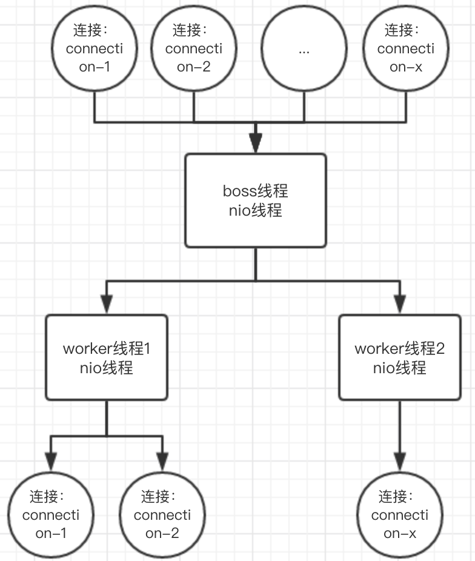

- [分布式理论](#分布式理论)
  - [CAP](#cap)
  - [BASE](#base)
  - [柔性事务和刚性事务](#柔性事务和刚性事务)
  - [一致性](#一致性)
- [分布式事务](#分布式事务)
  - [2PC 和 3PC](#2pc-和-3pc)
    - [2PC重要组件 (Seata的TA模式)](#2pc重要组件-seata的ta模式)
  - [TCC](#tcc)
  - [分布式一致性算法](#分布式一致性算法)
    - [Paxos](#paxos)
    - [Raft（muti-paxos）](#raftmuti-paxos)
    - [ZAB（muti-paxos）](#zabmuti-paxos)
  - [Dubbo相关](#dubbo相关)
    - [rpc框架的基本结构](#rpc框架的基本结构)
      - [Provider](#provider)
      - [Consumer](#consumer)
    - [Dubbo 和 Spring Cloud 主要区别](#dubbo-和-spring-cloud-主要区别)
    - [Dubbo底层线程模型 如何高性能](#dubbo底层线程模型-如何高性能)
    - [Dubbo的负载均衡算法](#dubbo的负载均衡算法)
      - [基于权重随机算法的 RandomLoadBalance](#基于权重随机算法的-randomloadbalance)
      - [基于最少活跃调用数算法的 LeastActiveLoadBalance](#基于最少活跃调用数算法的-leastactiveloadbalance)
      - [基于 hash 一致性的 ConsistentHashLoadBalance](#基于-hash-一致性的-consistenthashloadbalance)
      - [基于加权轮询算法的 RoundRobinLoadBalance](#基于加权轮询算法的-roundrobinloadbalance)
    - [Dubbo可用的的通信协议](#dubbo可用的的通信协议)
- [微服务限流、熔断和降级](#微服务限流熔断和降级)
  - [限流](#限流)
    - [原因](#原因)
    - [常见解决方案](#常见解决方案)
      - [计数器](#计数器)
      - [漏桶](#漏桶)
      - [令牌桶](#令牌桶)
  - [熔断](#熔断)
  - [降级](#降级)

# 分布式理论

## CAP

CAP 分布式 CAP 理论，任何一个分布式系统都无法同时满足 Consistency（一致性）、Availability（可用性）、Partition tolerance（分区容错性） 这三个基本需求。最多只能满足其中两项。而 Partition tolerance（分区容错性） 是必须的，因此一般是 CP ，或者 AP

## BASE

Basically Available（基本可用）
分布式系统在出现不可预知故障的时候，允许损失部分可用性
Soft state（软状态）
软状态也称为弱状态，和硬状态相对，是指允许系统中的数据存在中间状态，并认为该中间状态的存在不会影响系统的整体可用性，即允许系统在不同节点的数据副本之间进行数据听不的过程存在延时。
Eventually consistent（最终一致性）
最终一致性强调的是系统中所有的数据副本，在经过一段时间的同步后，最终能够达到一个一致的状态。因此，最终一致性的本质是需要系统保证最终数据能够达到一致，而不需要实时保证系统数据的强一致性
CAP 与 BASE 关系为：

在分布式的数据系统中，你能保证下面三个要求中的两个：一致性，可用性，以及分区容错性。在此模型上构建的系统将称作 BASE(基本上可用软状态最终一致)架构，不满足 ACID 性质。

## 柔性事务和刚性事务

刚性事务满足ACID理论
柔性事务满足BASE理论（基本可用，最终一致）

## 一致性

数据一致性通常指关联数据之间的逻辑关系是否正确和完整。在分布式系统中，数据一致性往往指的是由于数据的复制，不同数据节点中的数据内容是否完整并且相同。

一致性还分为强一致性，弱一致性，还有最终一致性。强一致性就是马上就保持一致。

最终一致性是指经过一段时间后，可以保持一致。

# 分布式事务

## 2PC 和 3PC

分布式事务是指会涉及到操作多个数据库的事务。目的是为了保证分布式系统中的数据一致性。分布式事务类型：二阶段提交 2PC ，三阶段提交 3PC。

2PC ：第一阶段：准备阶段（投票阶段）和第二阶段：提交阶段（执行阶段）。

3PC ：三个阶段：CanCommit 、PreCommit 、DoCommit。

### 2PC重要组件 (Seata的TA模式)

事务协调器 TC
维护全局和分支事务的状态，指示全局提交或者回滚。

事务管理者 TM
开启、提交或者回滚一个全局事务。

资源管理者 RM
管理执行分支事务的那些资源，向TC注册分支事务、上报分支事务状态、控制分支事务的提交或者回滚。

TM 请求 TC，开始一个新的全局事务，TC 会为这个全局事务生成一个 XID。
XID 通过微服务的调用链传递到其他微服务。
RM 把本地事务作为这个XID的分支事务注册到TC。
TM 请求 TC 对这个 XID 进行提交或回滚。
TC 指挥这个 XID 下面的所有分支事务进行提交、回滚。

## TCC

**T（Try）** 
锁资源：锁定某个资源，设置一个预备类的状态，冻结部分数据。

比如，订单的支付状态，先把状态修改为"支付中（PAYING）"。
比如，本来库存数量是 100 ，现在卖出了 2 个，不要直接扣减这个库存。在一个单独的冻结库存的字段，比如 prepare_remove_stock 字段，设置一个 2。也就是说，有 2 个库存是给冻结了。
积分服务的也是同理，别直接给用户增加会员积分。你可以先在积分表里的一个预增加积分字段加入积分。
比如：用户积分原本是 1190 ，现在要增加 10 个积分，别直接 1190 + 10 = 1200 个积分啊！你可以保持积分为 1190 不变，在一个预增加字段里，比如说 prepare_add_credit 字段，设置一个 10 ，表示有 10 个积分准备增加。

**C（Confirm）**：在各个服务里引入了一个 TCC 分布式事务的框架，事务管理器可以感知到各个服务的 Try 操作是否都成功了。假如都成功了， TCC 分布式事务框架会控制进入 TCC 下一个阶段，第一个 C 阶段，也就是 Confirm 阶段。此时，需要把 Try 阶段锁住的资源进行处理。

比如，把订单的状态设置为“已支付（Payed）”。
比如，扣除掉相应的库存。
比如，增加用户积分。

**C（Cancel）**：在 Try 阶段，假如某个服务执行出错，比如积分服务执行出错了，那么服务内的 TCC 事务框架是可以感知到的，然后它会决定对整个 TCC 分布式事务进行回滚。

TCC 分布式事务框架只要感知到了任何一个服务的 Try 逻辑失败了，就会跟各个服务内的 TCC 分布式事务框架进行通信，然后调用各个服务的 Cancel 逻辑。也就是说，会执行各个服务的第二个 C 阶段， Cancel 阶段。

比如，订单的支付状态，先把状态修改为" closed "状态。
比如，冻结库存的字段， prepare_remove_stock 字段，将冻结的库存 2 清零。
比如，预增加积分的字段， prepare_add_credit 字段，将准备增加的积分 10 清零。

## 分布式一致性算法

### Paxos

Proposal提案，即分布式系统的修改请求，可以表示为[提案编号N，提案内容value]
Client用户，类似社会民众，负责提出建议
Proposer议员，类似基层人大代表，负责帮Client上交提案
Acceptor投票者，类似全国人大代表，负责为提案投票，不同意比自己以前接收过的提案编号要小的提案，其他提案都同意，例如A以前给N号提案表决过，那么再收到小于等于N号的提案时就直接拒绝了
Learner提案接受者，类似记录被通过提案的记录员，负责记录提案

### Raft（muti-paxos）

说明：Paxos算法不容易实现，Raft算法是对Paxos算法的简化和改进
概念介绍
Leader总统节点，负责发出提案
Follower追随者节点，负责同意Leader发出的提案
Candidate候选人，负责争夺Leader

Raft算法将一致性问题分解为两个的子问题，Leader选举和状态复制
**Leader选举**
每个Follower都持有一个定时器

当定时器时间到了而集群中仍然没有Leader，Follower将声明自己是Candidate并参与Leader选举，同时将消息发给其他节点来争取他们的投票，若其他节点长时间没有响应Candidate将重新发送选举信息

获得多数派支持的Candidate将成为第M任Leader（M任是最新的任期）

在任期内的Leader会不断发送心跳给其他节点证明自己还活着，其他节点受到心跳以后就清空自己的计时器并回复Leader的心跳。这个机制保证其他节点不会在Leader任期内参加Leader选举。

当Leader节点出现故障而导致Leader失联，没有接收到心跳的Follower节点将准备成为Candidate进入下一轮Leader选举
若出现两个Candidate同时选举并获得了相同的票数，那么这两个Candidate将随机推迟一段时间后再向其他节点发出投票请求，这保证了再次发送投票请求以后不冲突
**状态复制**

Leader负责接收来自Client的提案请求（红色提案表示未确认）

提案内容将包含在Leader发出的下一个心跳中

若集群中出现网络异常，导致集群被分割，将出现多个Leader

被分割出的非多数派集群将无法达到共识，即脑裂，如图中的A、B节点将无法确认提案

当集群再次连通时，将只听从最新任期Leader的指挥，旧Leader将退化为Follower，如图中B节点的Leader（任期1）需要听从D节点的Leader（任期2）的指挥，此时集群重新达到一致性状态

### ZAB（muti-paxos）

说明：ZAB也是对Multi Paxos算法的改进，大部分和raft相同
和raft算法的主要区别：
对于Leader的任期，raft叫做term，而ZAB叫做epoch
在状态复制的过程中，raft的心跳从Leader向Follower发送，而ZAB则相反。

其他详见 zookeeper atomic broadcast

## Dubbo相关

### rpc框架的基本结构

- registry - 注册中心，当服务提供者启动时会向注册中心注册，然后注册中心会告知所有的消费者有新的服务提供者。
- provider - 服务提供者，远程调用过程中的被消费方。
- consumer - 服务消费者，远程调用过程中的消费方。
- monitor - 监视器，它主要负责统计服务的消费和调用情况

#### Provider

- 扫描服务提供者中所有提供服务的类（被@RpcService修饰的类），并将其交由BeanFactory管理。
- 启动Netty服务端，用来收到消费者的调用消息，并且返回调用结果。
- 向注册中心注册，本例中使用的注册中心是Zookeeper。

#### Consumer

对于服务消费者，我们框架需要对它的处理就是，为所有的RPC服务（被@RpcConsumer修饰的属性）设置上动态代理

### Dubbo 和 Spring Cloud 主要区别

Spring Cloud是一个完整的工具箱，而Dubbo只集成了部分组件，其他组件依赖于第三方

注册中心不同 Dubbo采用Zookeeper或者Redis作为注册中心 Spring Cloud采用Eureka Server作为注册中心

调用方式不同 Spring Cloud采用RPC方式 Dubbo采用REST API调用

### Dubbo底层线程模型 如何高性能

高性能的原理

dubbo基于netty。有5种派发策略：

默认是all：所有消息都派发到线程池，包括请求，响应，连接事件，断开事件，心跳等。 即worker线程接收到事件后，将该事件提交到业务线程池中，自己再去处理其他事。

direct：worker线程接收到事件后，由worker执行到底。

message：只有请求响应消息派发到线程池，其它连接断开事件，心跳等消息，直接在 IO线程上执行

execution：只请求消息派发到线程池，不含响应（客户端线程池），响应和其它连接断开事件，心跳等消息，直接在 IO 线程上执行

connection：在 IO 线程上，将连接断开事件放入队列，有序逐个执行，其它消息派发到线程池

2、业务线程池：

fixed：固定大小线程池，启动时建立线程，不关闭，一直持有。(缺省)

coreSize：200

maxSize：200

队列：SynchronousQueue

回绝策略：AbortPolicyWithReport - 打印线程信息jstack，之后抛出异常

cached：缓存线程池，空闲一分钟自动删除，需要时重建

limited：可伸缩线程池，但池中的线程数只会增长不会收缩。只增长不收缩的目的是为了避免收缩时突然来了大流量引起的性能问题

### Dubbo的负载均衡算法

#### 基于权重随机算法的 RandomLoadBalance

默认的算法 假设有三台服务器[A,B,C]，我们设置权重分别是5,3,2，权重总和为10，对于这三台服务器，可以认为A服务器在[0,5),B服务器在[5,8),C服务器在[8,10],此时提供一个随机数生成器（此处认为该随机数生成器算法足够好，产生的数据足够随机），那么让其生成一个[0,10)的随机数，这个数据将会落在其中一个区段，此时就将请求分发到对应的服务器

这里值得一提的时关于WarmUp的理解。系统在刚开始启动的时候都会有一段WarmUp的过程，这过程主要对一些线程池、数据库连接池等等的初始化，这些连接的创建、建立连接是十分消耗性能。另外本身JVM也有自己的预热策略。
如果对于这部分机器在处于服务预热的过程中就加以较大的流量，很容易让机器崩掉（因为此时正处于各种初始化的过程），因此我们提出一种优化的小手段，就是针对这部分正处于warm up的机器进行降权，让流量暂时减少流到这部分机器

#### 基于最少活跃调用数算法的 LeastActiveLoadBalance

基于最少活跃调用数，也是很朴素的一种调度思想，可以理想化的认为，当机器性能越好，处理的请求越快，那么在承接同样的请求数时，经过一段时间后，性能较好的机器将会剩下越少的请求。理所当然的，能者得多劳，这种算法会安排更多的请求到这一台机器

#### 基于 hash 一致性的 ConsistentHashLoadBalance

见redis的一致性hash算法

#### 基于加权轮询算法的 RoundRobinLoadBalance

轮询 + 基于性能考虑的加权

### Dubbo可用的的通信协议

**Dubbo**
Dubbo缺省协议采用单一长连接和NIO异步通讯，适合于小数据量大并发的服务调用，以及服务消费者机器数远大于服务提供者机器数的情况

**rmi**
RMI协议采用JDK标准的java.rmi.*实现，采用阻塞式短连接和JDK标准序列化方式

**http**
采用Spring的HttpInvoker实现

**Hessian**
Hessian协议用于集成Hessian的服务，Hessian底层采用Http通讯，采用Servlet暴露服务，Dubbo缺省内嵌Jetty作为服务器实现

# 微服务限流、熔断和降级

## 限流

### 原因

突发大流量情况都是无法预知的，不知道什么时候会有10倍甚至20倍的流量打进来，如果真碰上这种情况，扩容是根本来不及的（弹性扩容都是虚谈，一秒钟能扩容完成吗？）

### 常见解决方案

常见的限流算法有：计数器、漏桶、令牌桶

#### 计数器

实现：采用计数器实现限流有点简单粗暴，一般我们会限制一秒钟的能够通过的请求数，比如限流qps为100，算法的实现思路就是从第一个请求进来开始计时，在接下去的1s内，每来一个请求，就把计数加1，如果累加的数字达到了100，那么后续的请求就会被全部拒绝。等到1s结束后，把计数恢复成0，重新开始计数

#### 漏桶

队列加入 慢慢处理

#### 令牌桶

类似漏桶 生产令牌 根据qps分发

## 熔断

在微服务架构中，微服务是完成一个单一的业务功能，这样做的好处是可以做到解耦，每个微服务可以独立演进。但是，一个应用可能会有多个微服务组成，微服务之间的数据交互通过远程过程调用完成。这就带来一个问题，假设微服务A调用微服务B和微服务C，微服务B和微服务C又调用其它的微服务。如果调用链路上某个微服务的调用响应时间过长或者不可用，对微服务A的调用就会占用越来越多的系统资源，进而引起系统崩溃，所谓的“雪崩效应

服务熔断的作用类似于我们家用的保险丝，当某服务出现不可用或响应超时的情况时，为了防止整个系统出现雪崩，暂时停止对该服务的调用

## 降级

服务降级是从整个系统的负荷情况出发和考虑的，对某些负荷会比较高的情况，为了预防某些功能（业务场景）出现负荷过载或者响应慢的情况

在其内部暂时舍弃对一些非核心的接口和数据的请求，而直接返回一个提前准备好的fallback（退路）错误处理信息。这样，虽然提供的是一个有损的服务，但却保证了整个系统的稳定性和可用性。
