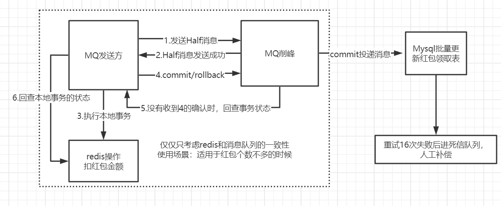

- [高并发场景设计](#高并发场景设计)
    - [抢红包设计](#抢红包设计)
    

# 高并发场景设计
## 十亿红包雨的设计
场景：
十亿红包雨如果是你会怎么设计这个需求？

想法： 假设每个用户10元，那么数据量也是千万的级别 。 因为是红包雨，请求可以分散掉。数据量大概就是百万级别的qps。
假设单机 10w并发量 -> 几十台机器应该就可以满足情况。
扣减红包如果考虑用数据库扣减不太现实，数据库连接池也不可能抗住这么大的并发量。可以考虑使用红包分片存储

扣减红包:

（1）redis单节点虽然扛得住10w并发，且rt比较小.但是也会增加一段时间的延时，redis的超时问题处理起来比较麻烦。分布式系统出现一系列比较复杂的问题就是因为有超时存在。还有数据同步这一个网络通信时间的存在

（2）金额放在本地内存去扣减这样性能会比较高。比如配置有100台服务器平均100w扣减/台。 这时候如果想知道哪些用户分到了多少钱，就需要将数据持久化到数据库。如果每个用户都去写数据库那么数据库也很难扛得住那么就在内存中去生成一个队列，在一个短暂的时间窗口将这些流水批量的去写入数据库。也可以大大降低数据库的压力将红包扣减和批量写入放到一个事务中，当红包扣减成功后才会批量写入。这样保证了扣减和批量写入是一个原子操作底层的数据库也是批量去写入没有任何锁的争抢。性能也可以上来。

红包扣减为什么不能用批量的方式?

批量扣金额用数据库的话是会有行锁的竞争。不太容易扩容.

怎么保证高可用或者某一个节点金额已经没有了,另外的节点还有金额，但用户打到没有金额的这个节点怎么办？

整体来说负载均衡，两个节点的剩余金额不会差很多。如果真的没有抢到只能说自己运气不好了吧，因为设计的初衷是不能红包不能多发，达到不超发的目的即可。
比如某个节点挂掉，可以不考虑。但是服务器的数量一定要大于你实际估算的，不然当有一个节点挂掉，那么剩余的机器没办法承载整个流量会造成雪崩。
压测需要100台，那么准备多一点比如120台保证系统的可用性。

这个系统架构虽然没有引入redis、mq，但是可靠性得到了保障，当引入第三方的很多中间件的话，反而会增加整个系统的复杂程度
每增加一个新的组件，那么整个系统面临的风险，还有脆弱性都会增加。定位问题也会更加难，所以后端的系统根据情况尽量简单一些也可以

补充：
假设有1000w人抢红包，应该怎么设计?

1.减少客户端和服务端的交互

2.将一行锁，分多行，提高并发

3.通过内存数据库和MQ，分发压力

4.通过事务消息，保证数据的一致性

高并发情况下考虑使用redis。因为redis基于内存操作，redis 10W/s,那么100台就够了（如果是红包雨允许3s时延，30台服务器都够了).redis用于扣减红包金额。后续还需要使用MQ进行削峰处理
考虑：

（1）先redis再发消息到MQ，redis操作成功，但发送消息失败，不可行

（2）先MQ再redis，MQ成功，但是redis操作失败，数据仍然不一致。不可行
（3）考虑使用事务消息->RocketMQ 事务消息包裹处理逻辑

