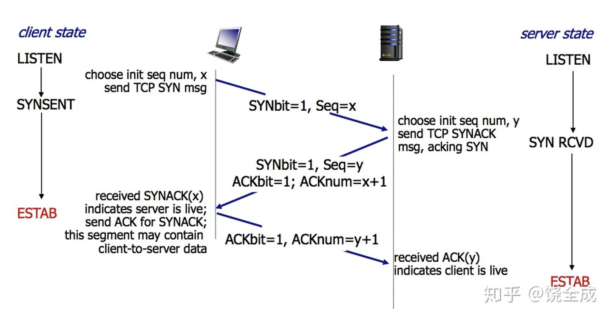
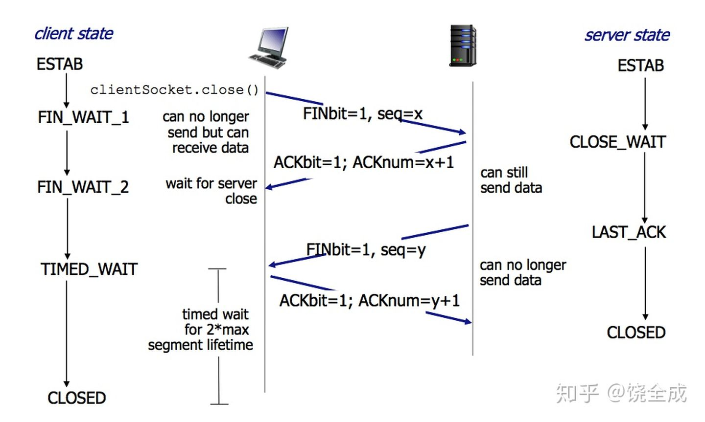

- [TCP用塞控制和流量控制](#tcp用塞控制和流量控制)
- [三次握手 四次挥手流程](#三次握手-四次挥手流程)
  - [三次握手](#三次握手)
  - [四次挥手](#四次挥手)
  - [TIME_WAIT和CLOSE_WAIT状态分别出现在哪，执行什么功能](#time_wait和close_wait状态分别出现在哪执行什么功能)
  - [TIME_WAIT的作用](#time_wait的作用)
  - [为什么连接的时候是三次握手，关闭的时候却是四次挥手？](#为什么连接的时候是三次握手关闭的时候却是四次挥手)
- [问题排查方式](#问题排查方式)
  - [大量 TIME_WAIT的问题 (曾经遇到过)](#大量-time_wait的问题-曾经遇到过)
  
## TCP用塞控制和流量控制

- 流量控制是为了解决发送方和接收方速度不同而导致的数据丢失问题,当发送方发送的太快,接收方来不及接受就会导致数据丢失,流量控制用滑动窗口的形式解决问题
  - 窗口就是缓冲区,用来暂时存储数据等待发送和接收,其实就是对每一次发送的数据大小进行限制,每个窗口的都有大小限制,超过部分不能发送,可以不用每次发送报文等待ACK确认,只要保证发送的报文再发送窗口内部就行,消除了等待确认的时间,大大提高效率
- 拥塞控制是为了解决过多的数据注入到网络,导致网络奔溃,超过负荷.当发送方发送数据大量的数据会注入到网络,如果没有限制,网络就会超负荷变卡,拥塞控制的用的是拥塞窗口解决的问题的
  - 慢开始
  慢开始的含义就是讲窗口先设置为1,每个传输轮次大小增长一倍,直到大道慢开始的门限(ssthresh),这时候慢开始阶段结束
  - 拥塞避免
  慢开始结束后,接下来就是拥塞避免,这个阶段拥塞窗口在每个传输轮次数量加1,直到触发了网络拥塞,窗口大小和门限都变为拥塞时最大的值得一半,然后重新开始慢开始阶段
  - 快重传
  快重传指的是当接受方收到顺序错误得数据时不接收数据,同时重复发起对于之前数据的确认,发动到第三次,发送方得知自己的一部分数据再发送中丢失,立即发起重传,不需要等待下一次发送信息时一起发送过去.,且重传时触发和拥塞一样得情况,进入快恢复阶段

## 三次握手 四次挥手流程


### 三次握手

第一次握手：建立连接时，客户端发送syn包（syn=x）到服务器，并进入SYN_SENT状态，等待服务器确认；SYN：同步序列编号（Synchronize Sequence Numbers）。

第二次握手：服务器收到syn包，必须确认客户的SYN（ack=x+1），同时自己也发送一个SYN包（syn=y），即SYN+ACK包，此时服务器进入SYN_RECV状态；

第三次握手：客户端收到服务器的SYN+ACK包，向服务器发送确认包ACK(ack=y+1），此包发送完毕，客户端和服务器进入ESTABLISHED（TCP连接成功）状态，完成三次握手



### 四次挥手

1）客户端进程发出连接释放报文，并且停止发送数据。释放数据报文首部，FIN=1，其序列号为seq=u（等于前面已经传送过来的数据的最后一个字节的序号加1），此时，客户端进入FIN-WAIT-1（终止等待1）状态。 TCP规定，FIN报文段即使不携带数据，也要消耗一个序号。
2）服务器收到连接释放报文，发出确认报文，ACK=1，ack=u+1，并且带上自己的序列号seq=v，此时，服务端就进入了CLOSE-WAIT（关闭等待）状态。TCP服务器通知高层的应用进程，客户端向服务器的方向就释放了，这时候处于半关闭状态，即客户端已经没有数据要发送了，但是服务器若发送数据，客户端依然要接受。这个状态还要持续一段时间，也就是整个CLOSE-WAIT状态持续的时间。
3）客户端收到服务器的确认请求后，此时，客户端就进入FIN-WAIT-2（终止等待2）状态，等待服务器发送连接释放报文（在这之前还需要接受服务器发送的最后的数据）。
4）服务器将最后的数据发送完毕后，就向客户端发送连接释放报文，FIN=1，ack=u+1，由于在半关闭状态，服务器很可能又发送了一些数据，假定此时的序列号为seq=w，此时，服务器就进入了LAST-ACK（最后确认）状态，等待客户端的确认。
5）客户端收到服务器的连接释放报文后，必须发出确认，ACK=1，ack=w+1，而自己的序列号是seq=u+1，此时，客户端就进入了TIME-WAIT（时间等待）状态。注意此时TCP连接还没有释放，必须经过2MSL（最长报文段寿命）的时间后，当客户端撤销相应的TCB后，才进入CLOSED状态。
6）服务器只要收到了客户端发出的确认，立即进入CLOSED状态。同样，撤销TCP后，就结束了这次的TCP连接。可以看到，服务器结束TCP连接的时间要比客户端早一些。


### TIME_WAIT和CLOSE_WAIT状态分别出现在哪，执行什么功能

TIME_WAIT 出现在客服端终止连接之后 作用是等待关闭TCP连接 经过**2MSL**时间释放
CLOSE_WAIT 出现在客服端发送FIN 服务端确认之后 作用是等待发送自己的FIN段。

### TIME_WAIT的作用

1. 可靠地实现TCP全双工连接的终止
在进行关闭连接四次挥手协议时，最后的ACK是由主动关闭端发出的，如果这个最终的ACK丢失，服务器将重发最终的FIN，
因此客户端必须维护状态信息允许它重发最终的ACK。如果不维持这个状态信息，那么客户端将响应RST分节，服务器将此分节解释成一个错误（在java中会抛出connection reset的SocketException)。
因而，要实现TCP全双工连接的正常终止，必须处理终止序列四个分节中任何一个分节的丢失情况，主动关闭的客户端必须维持状态信息进入TIME_WAIT状态。

2. 允许老的重复分节在网络中消逝
TCP分节可能由于路由器异常而“迷途”，在迷途期间，TCP发送端可能因确认超时而重发这个分节，迷途的分节在路由器修复后也会被送到最终目的地，这个原来的迷途分节就称为lost duplicate。
在关闭一个TCP连接后，马上又重新建立起一个相同的IP地址和端口之间的TCP连接，后一个连接被称为前一个连接的化身（incarnation)，那么有可能出现这种情况，前一个连接的迷途重复分组在前一个连接终止后出现，从而被误解成从属于新的化身。
为了避免这个情况，TCP不允许处于TIME_WAIT状态的连接启动一个新的化身，因为TIME_WAIT状态持续2MSL，就可以保证当成功建立一个TCP连接的时候，来自连接先前化身的重复分组已经在网络中消逝。

### 为什么连接的时候是三次握手，关闭的时候却是四次挥手？

答：因为当Server端收到Client端的SYN连接请求报文后，可以直接发送SYN+ACK报文。其中ACK报文是用来应答的，SYN报文是用来同步的。但是关闭连接时，当Server端收到FIN报文时，很可能并不会立即关闭SOCKET，所以只能先回复一个ACK报文，告诉Client端，"你发的FIN报文我收到了"。只有等到我Server端所有的报文都发送完了，我才能发送FIN报文，因此不能一起发送。故需要四步握手。

## 问题排查方式

```shell
#查看协议连接及状态
netstat -an 
#统计各状态的tcp连接数量
netstat -na | awk '/^tcp/ {++S[$NF]} END {for(a in S) print a, S[a]}' 
# tcp 表示仅筛选tcp存在的行(忽略socket等其他方式)
# $NF表示最后一列的数据 
# S为一个数组 记录的是++后的统计数量
```

### 大量 TIME_WAIT的问题 (曾经遇到过)

在高并发短连接的TCP服务器上，当服务器处理完请求后立刻主动正常关闭连接。这个场景下会出现大量socket处于TIME_WAIT状态。如果客户端的并发量持续很高，此时部分客户端就会显示连接不上。
我来解释下这个场景。主动正常关闭TCP连接，都会出现TIME_WAIT。

1. 高并发可以让服务器在短时间范围内同时占用大量端口，而端口有个0~65535的范围，并不是很多，刨除系统和其他服务要用的，剩下的就更少了。

2. 在这个场景中，短连接表示“业务处理+传输数据的时间 远远小于 TIME_WAIT超时的时间”的连接。

      这里有个相对长短的概念，比如取一个web页面，1秒钟的http短连接处理完业务，在关闭连接之后，这个业务用过的端口会停留在TIMEWAIT状态几分钟，而这几分钟，其他HTTP请求来临的时候是无法占用此端口的(占着茅坑不拉翔)。

单用这个业务计算服务器的利用率会发现，服务器干正经事的时间和端口（资源）被挂着无法被使用的时间的比例是 1：几百，服务器资源严重浪费。（说个题外话，从这个意义出发来考虑服务器性能调优的话，长连接业务的服务就不需要考虑TIMEWAIT状态。同时，假如你对服务器业务场景非常熟悉，你会发现，在实际业务场景中，一般长连接对应的业务的并发量并不会很高。

解决方案
通过sysctl.conf 调整服务器的配置
```conf
net.ipv4.tcp_syncookies = 1 表示开启SYN Cookies。当出现SYN等待队列溢出时，启用cookies来处理，可防范少量SYN攻击，默认为0，表示关闭；
net.ipv4.tcp_tw_reuse = 1 表示开启重用。允许将TIME-WAIT sockets重新用于新的TCP连接，默认为0，表示关闭；
net.ipv4.tcp_tw_recycle = 1 表示开启TCP连接中TIME-WAIT sockets的快速回收，默认为0，表示关闭。
net.ipv4.tcp_fin_timeout 修改系默认的 TIMEOUT 时间
```